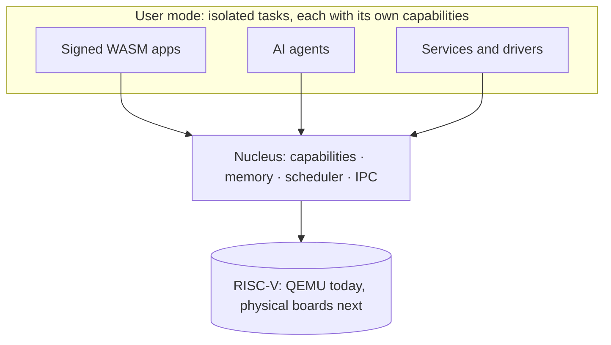

<p align="center">
  
</p>

<p align="center">
  A clean-slate, capability-based operating system for RISC-V, written in Rust.
</p>

<p align="center">
  <a href="https://anvaya.dev">Website</a> ·
  <a href="https://anvaya.dev/demo">Live demo</a> ·
  <a href="https://anvaya.dev/status">Status</a> ·
  <a href="https://anvaya.dev/manifesto">Manifesto</a> ·
  <a href="https://anvaya.dev/changelog">Changelog</a>
</p>

> **Status, v1.7.2 (25 September 2026):** a QEMU-proven research release.
> AnvayaOS has not yet booted on physical hardware and has not had an external
> security audit. The source repositories are private until the first public
> release.

## What AnvayaOS Is

AnvayaOS gives nothing power by default. Every program, driver and AI agent can
reach only the resources it has been explicitly handed as a capability, and
every capability can be traced back to where it came from and revoked.

The kernel stays small. Drivers, storage and networking run outside it as
isolated, signed tasks; all cryptography is post-quantum by default; and AI
agents run inside audited execution contexts with a stated goal. Every release
ships with a reproducible boot log, so nothing is claimed that the log cannot
show.



## What Works Today

Proven under QEMU by every release's gates:

- Capability-based security with delegation, attenuation and lineage-based revocation
- Preemptive real-time scheduling across four harts, with synchronous and asynchronous IPC
- Drivers, storage and networking as signed, isolated user-mode tasks
- ML-KEM, ML-DSA and SLH-DSA verified against NIST's official test vectors, with hybrid signatures on every package
- Twelve signed WebAssembly apps running with deny-by-default permissions
- AI agents with identity, goals, quotas and a hash-chained audit trail

You can watch the kernel boot in your browser at
[anvaya.dev/demo](https://anvaya.dev/demo). It finishes at an interactive shell.

## Roadmap

| Release | Scope | State |
| --- | --- | --- |
| 0.1 to 0.9 | First boot, capabilities, WASM apps, AI agents, constitution, post-quantum crypto, device mesh, energy broker | Released |
| 1.0 | QEMU-proven milestone | Released |
| 1.2 | Multi-core real-time scheduling and asynchronous IPC | Released |
| 1.5 | Drivers as signed user-mode tasks | Released |
| 1.6 | Content-addressed storage service | Released |
| 1.7 | Capability sockets and network service | Released |
| 1.7.2 | Audit repairs and native intelligence (25 September 2026) | Released |
| 1.8 | Intelligence and verification maturation | In progress |
| Next | First boot on physical RISC-V hardware | Planned |

Every milestone and its evidence is on the [status page](https://anvaya.dev/status).

## Repositories

| Repository | What it holds | Visibility |
| --- | --- | --- |
| [anvaya](https://github.com/AnvayaOS/anvaya) | The operating system: nucleus, services, runtime and proofs | Private |
| [rfcs](https://github.com/AnvayaOS/rfcs) | Design proposals and architecture decisions | Private |
| [anvaya-site](https://github.com/AnvayaOS/anvaya-site) | Source of anvaya.dev | Private |
| [anvaya-docs](https://github.com/AnvayaOS/anvaya-docs) | Documentation hub (planned) | Private |
| [anvaya-sdk](https://github.com/AnvayaOS/anvaya-sdk) | Developer SDK (planned) | Private |
| [anvaya-apps](https://github.com/AnvayaOS/anvaya-apps) | Reference apps and demos (planned) | Private |
| [anvaya-hardware](https://github.com/AnvayaOS/anvaya-hardware) | Hardware specs and RISC-V extensions (planned) | Private |
| [anvaya-infra](https://github.com/AnvayaOS/anvaya-infra) | CI/CD and infrastructure automation (planned) | Private |
| [.github](https://github.com/AnvayaOS/.github) | This profile and the community files | Public |

## Get Involved

AnvayaOS welcomes Rust and systems developers, formal-verification and
security researchers, RISC-V hardware engineers, AI-systems researchers, and
technical writers.

- **Contribute:** [anvaya.dev/contribute](https://anvaya.dev/contribute), and
  read the [contributing guide](https://github.com/AnvayaOS/.github/blob/main/CONTRIBUTING.md)
  and [Code of Conduct](https://github.com/AnvayaOS/.github/blob/main/CODE_OF_CONDUCT.md).
- **Sponsor or partner:** [anvaya.dev/sponsor](https://anvaya.dev/sponsor).
- **Security:** report vulnerabilities privately, as described in the
  [security policy](https://github.com/AnvayaOS/.github/blob/main/SECURITY.md).

## License

AnvayaOS is licensed under either of the
[Apache License, Version 2.0](https://github.com/AnvayaOS/.github/blob/main/LICENSE-APACHE)
or the [MIT License](https://github.com/AnvayaOS/.github/blob/main/LICENSE-MIT),
at your option.

## Citation

```bibtex
@misc{anvayaos,
  title        = {AnvayaOS: The Operating System for the Intelligence Age},
  author       = {Alphin Tom},
  year         = {2026},
  howpublished = {\url{https://anvaya.dev}},
  note         = {Contact: info@anvaya.dev; GitHub: https://github.com/AnvayaOS}
}
```
